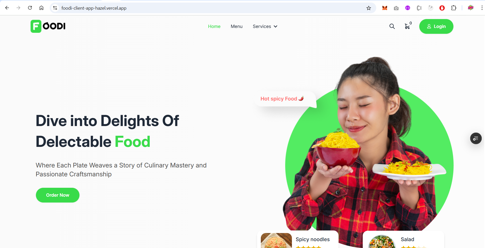

# 🍽️ Restaurant Website – Frontend

This is the **frontend** of a full-featured restaurant website built with **React.js** and **Tailwind CSS** as part of a complete MERN stack application.

## 🖼 Screenshots

### 🏠 Home Page




## 🔧 Technologies Used

- React.js (Functional Components & Hooks)
- Tailwind CSS
- React Router DOM
- Firebase Authentication
- JWT (via HTTP-only cookies)
- Axios
- React Toastify

## 🌟 Features

- 🔐 **User Authentication** (Firebase)
- 🍔 **Responsive Menu Pages**
- 🛒 **Cart System**
- 💳 **Online Order & Checkout Flow**
- 🔐 **JWT-based session management**
- 🖼️ **Image Upload and Hosting**
- 👨‍🍳 **Admin Panel Access via Role**
- 🌐 **Fully Responsive Design**

## 🚀 Getting Started

```bash
# 1. Clone the repository
git clone https://github.com/sirdashasan/foodi.git

# 2. Navigate to the project directory
cd restaurant-frontend

# 3. Install dependencies
npm install

# 4. Start the development server
npm run dev
```

# ⚙️ Environment Configuration (.env.local)

```bash
VITE_APIKEY=                # Your Firebase Web API Key
VITE_AUTHDOMAIN=            # Your Firebase Auth Domain
VITE_PROJECTID=             # Your Firebase Project ID
VITE_STORAGEBUCKET=         # Your Firebase Storage Bucket
VITE_MESSAGINGSENDERID=     # Firebase Messaging Sender ID
VITE_APPID=                 # Firebase App ID

VITE_IMAGE_HOSTING_KEY=     # API key for image hosting service (e.g., imgbb or similar)
VITE_Stripe_PK=             # Your Stripe public key for payment processing
```
